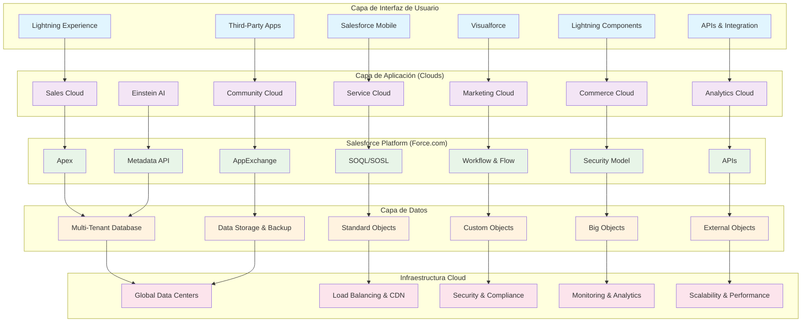

# Arquitectura General de Salesforce

## Diagrama de Arquitectura

## 🏗️ Arquitectura de Salesforce por Capas

### 1. **Capa de Interfaz de Usuario**

Esta capa representa todos los puntos de acceso que los usuarios tienen para interactuar con Salesforce:

- **Lightning Experience**: Interfaz web moderna y responsiva que proporciona una experiencia de usuario optimizada
- **Salesforce Mobile**: Aplicaciones nativas para iOS y Android que permiten acceso móvil completo
- **Visualforce**: Páginas personalizadas construidas con tecnología web estándar (HTML, CSS, JavaScript)
- **Lightning Components**: Componentes reutilizables que incluyen Lightning Web Components (LWC) y Aura Components
- **APIs & Integration**: Interfaces REST/SOAP que permiten integraciones con sistemas externos
- **Third-Party Apps**: Aplicaciones desarrolladas por terceros disponibles en el AppExchange

### 2. **Capa de Aplicación (Clouds)**

Esta capa contiene las aplicaciones especializadas de Salesforce, cada una diseñada para casos de uso específicos:

- **Sales Cloud**: CRM completo con gestión de leads, cuentas, contactos y oportunidades
- **Service Cloud**: Plataforma de atención al cliente con gestión de casos, base de conocimientos y Live Agent
- **Marketing Cloud**: Suite de marketing digital con email marketing, Journey Builder y Social Studio
- **Commerce Cloud**: Plataformas de comercio electrónico B2B y B2C con gestión completa de pedidos
- **Analytics Cloud**: Einstein Analytics y Tableau CRM para análisis avanzado de datos
- **Community Cloud**: Experience Cloud que permite crear portales para partners, clientes y empleados
- **Einstein AI**: Plataforma de inteligencia artificial con machine learning y análisis predictivo

### 3. **Salesforce Platform (Force.com)**

El núcleo de desarrollo y personalización de Salesforce:

- **Apex**: Lenguaje de programación server-side con triggers, clases y métodos para lógica de negocio
- **SOQL/SOSL**: Lenguajes de consulta (SOQL) y búsqueda (SOSL) optimizados para datos de Salesforce
- **Workflow & Flow**: Herramientas de automatización incluyendo Process Builder y Flow Builder
- **Security Model**: Sistema robusto de seguridad con perfiles, roles, reglas de compartición y permisos
- **APIs**: Conjunto completo de APIs incluyendo REST, SOAP, Bulk API y Streaming API
- **AppExchange**: Marketplace con miles de aplicaciones y componentes, incluyendo paquetes gestionados
- **Metadata API**: Herramientas para deployment, DevOps y gestión de configuraciones

### 4. **Capa de Datos**

La capa de persistencia y gestión de datos:

- **Multi-Tenant Database**: Base de datos Oracle compartida con completo aislamiento de datos entre organizaciones
- **Standard Objects**: Objetos predefinidos como Account, Contact, Opportunity, Case, Lead, etc.
- **Custom Objects**: Objetos definidos por el usuario con campos, relaciones y lógica personalizados
- **Big Objects**: Almacenamiento optimizado para grandes volúmenes de datos (millones/billones de registros)
- **External Objects**: Acceso en tiempo real a datos externos mediante conectores OData y REST
- **Data Storage & Backup**: Sistema automatizado de respaldo, archivado y recuperación ante desastres

### 5. **Infraestructura Cloud**

La base tecnológica que soporta toda la plataforma:

- **Global Data Centers**: Red mundial de centros de datos distribuidos geográficamente
- **Load Balancing & CDN**: Balanceadores de carga y red de distribución de contenido para optimizar rendimiento
- **Security & Compliance**: Seguridad de nivel empresarial con certificaciones SOC, ISO, GDPR, HIPAA
- **Monitoring & Analytics**: Monitoreo continuo del sistema y análisis de rendimiento en tiempo real
- **Scalability & Performance**: Escalabilidad automática y optimización continua del rendimiento

## 🔄 Flujo de Datos y Comunicación

La arquitectura de Salesforce sigue un patrón de capas donde cada nivel se comunica con el siguiente:

1. **Usuario → Interfaz**: Los usuarios interactúan a través de las diversas interfaces disponibles
2. **Interfaz → Aplicación**: Las interfaces envían solicitudes a las aplicaciones específicas (Clouds)
3. **Aplicación → Plataforma**: Las aplicaciones utilizan los servicios de la plataforma Force.com
4. **Plataforma → Datos**: La plataforma accede y manipula los datos según las reglas de negocio
5. **Datos → Infraestructura**: Los datos se almacenan y gestionan en la infraestructura cloud

## 🎯 Ventajas de esta Arquitectura

### **Escalabilidad**
- Arquitectura multi-tenant que permite servir a millones de usuarios
- Escalabilidad horizontal automática según la demanda

### **Seguridad**
- Modelo de seguridad granular a nivel de objeto, campo y registro
- Aislamiento completo de datos entre organizaciones

### **Flexibilidad**
- Plataforma altamente personalizable sin necesidad de infraestructura propia
- Capacidad de desarrollo tanto declarativo como programático

### **Integración**
- APIs robustas para integración con cualquier sistema externo
- Conectores pre-construidos para aplicaciones populares

### **Mantenimiento**
- Actualizaciones automáticas tres veces al año
- Sin necesidad de gestión de infraestructura por parte del cliente

## 🔧 Consideraciones Técnicas

### **Límites del Gobernador**
Salesforce implementa límites para garantizar el rendimiento multi-tenant:
- Límites de CPU, memoria y consultas por transacción
- Límites diarios de API calls y almacenamiento

### **Mejores Prácticas**
- Diseño eficiente de consultas SOQL
- Uso apropiado de triggers y workflows
- Implementación de patrones de integración adecuados

### **Monitoreo y Optimización**
- Herramientas nativas para monitoreo de rendimiento
- Análisis de uso de límites y optimización continua

Esta arquitectura hace de Salesforce una plataforma robusta, escalable y segura que puede adaptarse a las necesidades específicas de organizaciones de cualquier tamaño, desde startups hasta grandes empresas multinacionales.